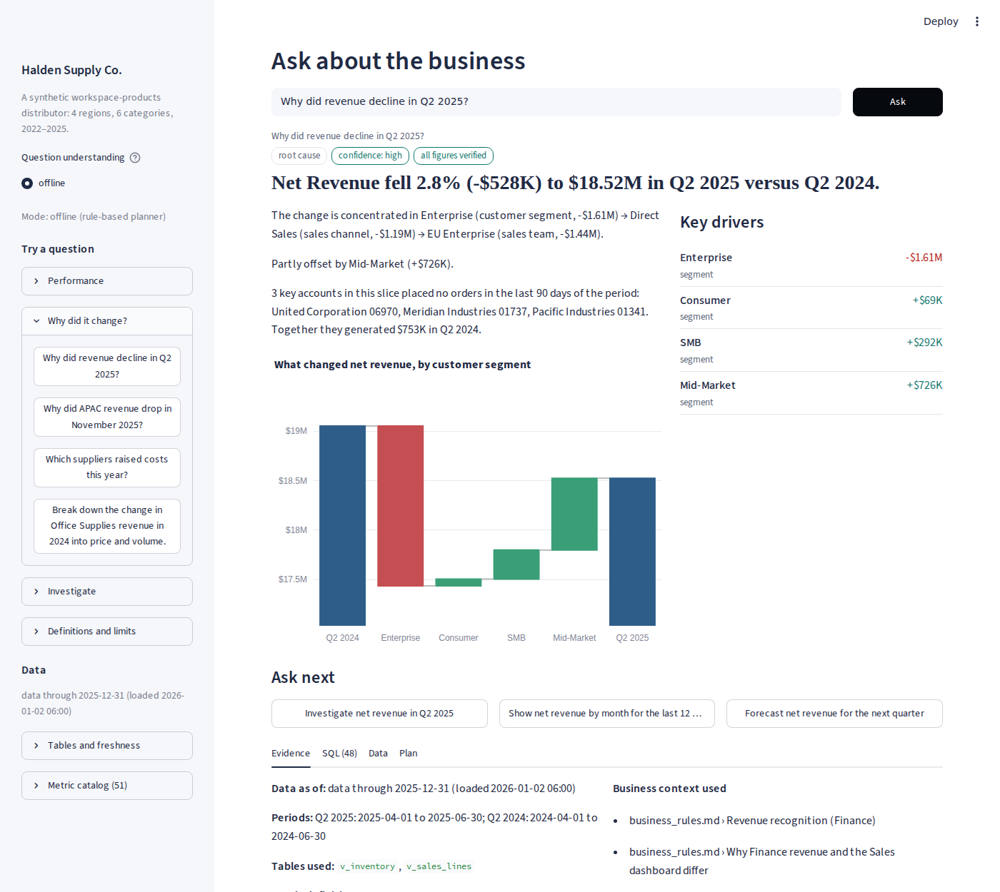
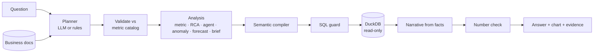

# AI Business Intelligence Copilot

Ask a business question in plain English. Get the answer, the reason behind it, and the evidence to check it.

## 🚀 Live Demo

**Try the deployed application:**

https://zubairlabs-ai-copilot.streamlit.app

The application lets you explore governed business metrics, root-cause analysis, anomaly detection, forecasting, multi-step investigations, and evidence-backed answers through a conversational BI interface.

> Demo environment: Halden Supply Co. — a synthetic workspace-products distributor created specifically for reproducible evaluation.



> **"Why did revenue decline in Q2 2025?"**
> Net Revenue fell 2.3% (-$431K) to $18.56M in Q2 2025 versus Q2 2024.. The change is concentrated in Enterprise → Direct Sales → the EU Enterprise team. Three European key accounts placed no orders after March; together they generated $758K in Q2 2024.
> *Evidence: 48 SQL queries, metric definitions, assumptions, sources. All figures verified.*

Most text-to-SQL demos stop at "what was revenue?". This project goes after the questions analysts actually spend time on (*why* did it change, is it real or a data glitch, what should we look at next) and makes every answer checkable.

## What it does

| | |
|---|---|
| **Governed metrics** | 56 metric definitions in [`config/metrics.yaml`](config/metrics.yaml). The LLM never writes SQL for a business metric; a compiler does, so "revenue" means the same thing every time. |
| **Root-cause analysis** | Finds where a change is concentrated and follows the business hierarchy (category → product, channel → sales team). Splits revenue into price, volume, mix and refunds, and separates margin changes into mix shifts and rate changes. Measures supplier cost effects, lost customers and stockouts. |
| **Investigation agent** | Multi-step investigations ("investigate why profit declined in Tech Accessories") with six analysis tools, a hard step limit and a visible trace. |
| **Anomaly detection** | Weekly scan across KPIs and slices that accounts for seasonality, and reports tracking outages as data issues, not business drops. |
| **Forecasting** | Models chosen by backtest, with 80% intervals and stated limits. |
| **Executive brief** | KPI movements, main concern with its driver, opportunity, unusual movements, suggested next steps. |
| **Business context (RAG)** | Business rules, incident log, data dictionary and past findings, cited in answers. |
| **Guardrails** | Read-only connection, sqlglot validation, table allow-list, row limits, timeouts, a read-only request policy, and a check that every number in a narrative matches a query result. |
| **Honest refusals** | Declines EBITDA, NPS, LTV, market share and out-of-range dates, and offers the closest real metric. |

## Results

Evaluated against a synthetic company with **9 planted business events and 5 decoys**, so the true causes are known. Gold answers come from independently hand-written SQL.

| | Development set (137 q) | Held-out set (30 q) |
|---|---|---|
| Overall pass rate | 100% | **83.3%** |
| Metric answers matching gold SQL | 100% | 90% |
| Planted root causes recovered | 100% | 1 of 4 |
| Unsupported questions declined | 100% | 100% |
| Unsafe requests refused / malicious SQL blocked | 100% / 100% | n/a |
| Narratives with every number verified | 99.1% | 96% |

The held-out questions were written after development, phrased differently and run once. The gap between the two columns is real, and it's explained in [docs/03_evaluation.md](docs/03_evaluation.md). In short, unfamiliar phrasing makes the rule-based planner ask for clarification rather than guess, and that's the gap the optional LLM planner is there to close. Results are offline mode; no LLM numbers are claimed until measured.

## Architecture



More in [docs/02_architecture.md](docs/02_architecture.md).

## Quickstart

```bash
git clone https://github.com/muhammadzubair-data/ai-business-intelligence-copilot.git
cd ai-business-intelligence-copilot
pip install -r requirements.txt
pip install -e .

python -m bi_copilot.cli generate          # demo warehouse, ~30s (or --full for ~4.2M rows)
python -m bi_copilot.cli measure           # confirm all planted events are detectable
streamlit run app/streamlit_app.py         # the app (builds the warehouse itself if missing)
```

From the command line:

```bash
python -m bi_copilot.cli ask "Why did APAC revenue drop in November 2025?" --sql
python -m bi_copilot.cli eval              # development benchmark
python -m bi_copilot.cli eval --set holdout
pytest -q                                  # run the automated test suite
```

Or just `make setup && make app`.

## Configuration

Works fully offline by default. To add an LLM for question understanding and narrative writing:

| Variable | Purpose |
|---|---|
| `BI_COPILOT_LLM_PROVIDER` | `offline` (default), `anthropic` or `openai` |
| `ANTHROPIC_API_KEY`, `ANTHROPIC_MODEL` | Claude |
| `OPENAI_API_KEY`, `OPENAI_MODEL`, `OPENAI_BASE_URL` | OpenAI or any compatible endpoint (including local servers) |
| `BI_COPILOT_EMBEDDING_MODEL` | Adds dense embeddings to retrieval |
| `BI_COPILOT_DB` | Path to the DuckDB file |
| `BI_COPILOT_QUERY_TIMEOUT`, `BI_COPILOT_MAX_ROWS`, `BI_COPILOT_AGENT_MAX_STEPS` | Guardrail limits |

## Deploying to Streamlit Community Cloud

1. Push the repo to GitHub. The `.duckdb` file is git-ignored on purpose because it's over GitHub's size limit.
2. On share.streamlit.io choose the repo and set the main file to `app/streamlit_app.py`.
3. Optionally add `BI_COPILOT_LLM_PROVIDER` and an API key under **Secrets**.

The first visit builds the demo warehouse (about 30 seconds) and caches it.

## Project layout

```
config/metrics.yaml          metric catalog (the semantic layer)
warehouse/                   schema and analytical views
knowledge_base/              documents used for retrieval
src/bi_copilot/
  data/                      synthetic data generator and answer-key measurement
  semantic/                  catalog, compiler, planner, time parsing
  analytics/                 RCA, agent, anomaly, forecast, brief, charts, grounding
  rag/  llm/                 retrieval and model providers
  copilot.py                 orchestrator
  sql_guard.py  db.py        guardrails
app/streamlit_app.py         UI
eval/                        benchmark, held-out set, ground truth, results
scripts/build_benchmark.py   benchmark with hand-written gold SQL
tests/                       pytest suite
docs/                        data design, architecture, evaluation, case study
```

## Limitations

- **Synthetic data.** That is what makes the evaluation trustworthy, because the causes are known. It also means real data will be messier.
- **Planner coverage.** The rule-based planner covers the phrasings in the catalog's synonym lists. New phrasing leads to a clarification request (see the held-out results).
- **Causation.** Root-cause analysis shows where a change is concentrated and what moved with it. It doesn't prove causation, and the answers are worded accordingly.
- **Forecasts.** They are statistical baselines that don't know about planned promotions or price changes.

## Documentation

- [Data design](docs/01_data_design.md): the company, schema, and planted events
- [Architecture](docs/02_architecture.md): components and design decisions
- [Evaluation](docs/03_evaluation.md): method, results, and how to read them
- [Case study](docs/04_case_study.md): the project as a client story

## License

MIT
