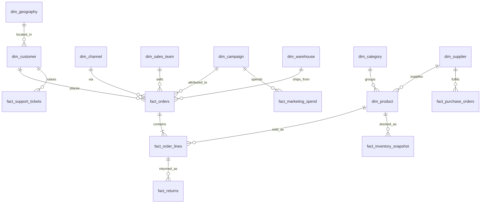

# 01 — Data Design: Halden Supply Co.

This document describes the synthetic company behind the AI Business Intelligence Copilot: what the business does, how the warehouse is structured, and which business events were deliberately planted in the data so the Copilot's analysis can be tested against a known truth.

## The company

Halden Supply Co. sells workspace products to businesses and consumers in four regions (North America, Europe, APAC, LATAM). It has around 800 SKUs across six categories grouped into three business units:

| Business unit | Categories |
|---|---|
| Workspace | Office Furniture, Ergonomics |
| Technology | Tech Accessories, Print & Imaging |
| Consumables | Office Supplies, Breakroom & Janitorial |

Customers fall into four segments: Enterprise, Mid-Market, SMB and Consumer. They buy through four channels: Direct Sales (with regional sales teams), Web Store, Marketplace and Partner resellers. Marketplace and Partner orders carry a channel fee.

The data covers 1 January 2022 to 31 December 2025. All amounts are in USD. The fiscal year starts on 1 February and is named after the calendar year it ends in, so FY2025 runs from February 2024 to January 2025. This is realistic for retail and gives the Copilot a genuine ambiguity to handle when someone asks about "last year".

## Warehouse structure

The warehouse is a star schema in DuckDB. Full DDL is in `warehouse/schema.sql`.

### Fact tables and grain

| Table | Grain | Department | Full scale (60K customers) | Demo (12K customers) |
|---|---|---|---|---|
| fact_orders | One order | Sales | 559K | 111K |
| fact_order_lines | One product line on an order | Sales | 2.09M | 416K |
| fact_returns | One return event | Sales / Finance | 46K | 9K |
| fact_marketing_spend | Campaign × day | Marketing | 82K | 82K |
| fact_web_sessions | Day × marketing channel × segment × country | Marketing | 421K | 421K |
| fact_inventory_snapshot | Product × warehouse × week | Operations | 726K | 726K |
| fact_purchase_orders | One purchase order line | Operations | 182K | 181K |
| fact_support_tickets | One ticket | Support | 56K | 11K |
| fact_opex_monthly | Month × department × expense type | Finance | 1.4K | 1.4K |

These are measured counts, not estimates. The full dataset is about 4.2 million rows (324 MB, about 2 minutes to build on one CPU core). The demo dataset uses 12,000 customers with their full history (about 1.9 million rows, 160 MB, about 30 seconds). Both are generated from a fixed random seed, so every run produces the same data.

The demo size was chosen by testing, not by guessing. At 6,000 customers, random noise hid two of the planted events (the Office Supplies volume effect and the APAC stockout dip). At 12,000 customers all 22 detectability checks pass, and they pass at full scale too (`python -m bi_copilot.cli measure`). Because the demo file is larger than GitHub's 100 MB limit, it is not committed; the app builds it on first start.

### Design decisions

**Prices and costs are stored at the moment of sale.** Each order line records the list price and unit cost that applied on the order date, taken from `product_price_history` and `product_cost_history`. This lets the Copilot separate price effects from cost effects without reconstructing history.

**Revenue has more than one legitimate definition.** The warehouse supports both, and the metric catalog will define them formally:

- Booked revenue (the Sales view): gross sales minus discounts, by order date, before refunds.
- Net revenue (the Finance view): gross sales minus discounts minus refunds, recognised on ship date, excluding cancelled orders.

**Some metrics are deliberately impossible.** Depreciation and amortisation are folded into "Other Operating" expenses and never broken out, so EBITDA cannot be calculated. The Copilot should say so rather than invent a figure.

**Customer attributes are static.** Segment and region do not change over time. This is a simplification (a real warehouse would use slowly changing dimensions) and is noted as a known limitation.

**Churn is derived, not stored.** There is no "churned" flag. Active and churned customers are defined in the metric catalog from ordering behaviour, which tests whether the Copilot uses the catalog definition.

**Provenance has a home.** `meta_table_freshness` records when each table was loaded and what date range it covers. The Copilot's evidence panel reads from it to show "data as of" alongside every answer.

## How the data is generated

Generation happens in two layers.

The baseline layer produces a healthy, ordinary business: modest growth by segment, weekly and annual seasonality (a strong Q4 with deeper holiday discounts, a soft January), realistic basket sizes, normal return rates around 3%, and random noise.

The event layer then applies the planted events on top. Each event is defined in `eval/ground_truth/planted_events.yaml` with its time window, scope and parameters. Keeping events as configuration rather than code means they can be switched off to produce a clean control dataset, which is useful for testing false positives in anomaly detection.

After generation, a measurement script calculates each event's realised effect from the actual data. Evaluation scores against these realised numbers, not the input parameters, because noise means the two never match exactly. The same script also checks that each event is actually detectable, for example that E01 really is the largest contributor to the Q2 2025 decline and has not been masked by seasonality.

## Planted events

These give root-cause analysis, anomaly detection and the executive brief a known truth to recover.

| ID | Event | Window | What the Copilot should find |
|---|---|---|---|
| E01 | Europe enterprise attrition | Q2 2025 | Three key accounts stop ordering; Europe × Enterprise drives the Q2 decline |
| E02 | Supplier cost increase | From Mar 2025 | Tech Accessories margin falls because Kestrel Components costs rose 18% |
| E03 | AeroDesk Pro defect | Oct–Nov 2024 | Refund and defect-ticket spike concentrated in one new product |
| E04 | Paid social efficiency decline | H2 2025 | CAC rises mainly from weaker SMB conversion |
| E05 | Office Supplies price rise | From Apr 2024 | Positive price effect outweighs negative volume effect |
| E06 | Mid-Market marketplace shift | From H2 2023 | Margin falls from channel mix, not price or volume |
| E07 | APAC stockout | Late Oct–Nov 2025 | Revenue dip caused by availability, not demand |
| E08 | Discount leakage | Q3 2025 | One North America sales team drives a jump in discounting |
| E09 | Ergonomics repeat purchases | H1 2025 | A positive opportunity for the executive brief |

## Decoys

A Copilot that finds every planted event but also invents causes is not trustworthy, so the data includes traps that are scored as well.

| ID | Trap | Correct behaviour |
|---|---|---|
| D01 | LATAM marketing rises while Europe revenue falls | Do not link the two |
| D02 | Three days of missing web sessions | Flag a data gap and cite the incident log, not a traffic collapse |
| D03 | Finance and Sales revenue differ | Explain the two definitions with numbers |
| D04 | Normal Q4 peak and January dip | Treat as seasonality, not an anomaly |
| D05 | EBITDA requested | Decline, explain what is missing, offer operating profit |

## Keeping the benchmark honest

The ground-truth file lives in `eval/ground_truth/` and is excluded from the RAG index. The knowledge base will contain the kinds of documents a real analytics team keeps (data dictionary, metric definitions, business rules, an incident log), and some of these legitimately help the Copilot. For example, the incident log explains D02. But nothing in the knowledge base states the planted events directly. The Copilot has to find them in the data.

## Next steps

1. Write the metric catalog (YAML) with formal definitions for net revenue, booked revenue, gross margin, AOV, CAC, conversion rate, return rate, active customer, churn and repeat-purchase rate.
2. Build the baseline generator and load the warehouse.
3. Add the event layer and the measurement script, then confirm every event is detectable.
4. Write the knowledge-base documents that the RAG layer will index.
