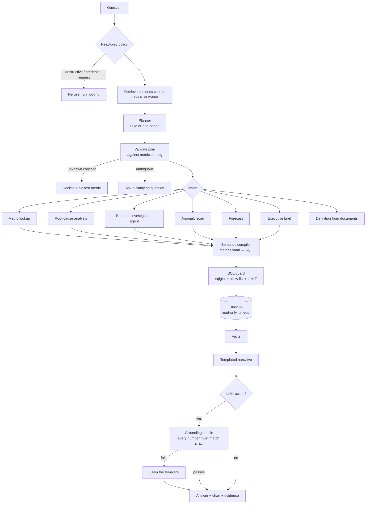

# Architecture

## The short version

The language model never writes SQL for a business metric and never produces a number the user sees. It does one job: turn a question into a structured plan. Everything after that is deterministic code that can be tested.

## Components

| Layer | File | What it does |
|---|---|---|
| Warehouse | `warehouse/schema.sql`, `views.sql` | Star schema in DuckDB with 9 fact tables. Analytical views are the only surface the Copilot queries. |
| Synthetic data | `data/generator.py` | Four years of a distributor's operations with 9 planted business events and 5 decoys. |
| Answer key | `data/measure.py` | Measures each planted effect with independent SQL and checks it is detectable. |
| Metric catalog | `config/metrics.yaml` | 56 governed metrics (simple, ratio, derived, custom templates), dimension synonyms, and a list of concepts the data can't support. |
| Compiler | `semantic/compiler.py` | Plan → SQL. Groups metrics by model, joins them, and expands derived formulas and custom templates. |
| Planner | `semantic/planner.py`, `timeparse.py` | Question → plan. The rule-based planner needs no key; the LLM planner is validated against the catalog and falls back to rules. |
| Guardrails | `sql_guard.py`, `db.py` | Parse-based validation, table allow-list, column checks, row limit, read-only connection, query timeout. |
| Retrieval | `rag/retriever.py` | Business rules, incident log, data dictionary and past findings, plus every metric definition. |
| Analytics | `analytics/` | Root-cause analysis, anomaly detection, forecasting, executive brief, investigation agent, chart selection, grounding check. |
| Orchestrator | `copilot.py` | Routes by intent and assembles the answer with its evidence. |
| UI | `app/streamlit_app.py` | Question box, the answer, KPIs, chart, drivers, and an evidence panel with the SQL, definitions, sources, assumptions and agent steps. |

## Design decisions and why

**Semantic layer instead of free-form text-to-SQL.** "Revenue" means one thing here: net revenue by ship date, after refunds. If a model writes SQL each time, it will sometimes use order date, forget refunds, or include cancelled orders. Every answer will look plausible, and some will be wrong. Compiling from a catalog makes the definition a reviewed artifact instead of a per-question guess. The cost is coverage: questions outside the catalog are declined rather than improvised. The evaluation has baseline modes (`raw_sql_llm`, `views_sql_llm`) that measure what free-form SQL gives up.

**Ratio metrics are decomposed exactly.** Splitting a margin change by category is a common source of wrong conclusions. The RCA uses `w1·r1 − w0·r0` per member, so the contributions add up to the overall change. It also separates each member into a rate effect and a mix effect. That is how it can say "contribution margin fell mostly because Marketplace's share grew from 15% to 34%" instead of blaming whichever channel happened to shrink.

**Drill-down follows the business hierarchy.** After picking the dimension where a change is most concentrated, the analyzer prefers the natural next level (category → product, channel → sales team, region → country) when one member explains most of the slice. That is how it gets from "return rate up" to "Office Furniture" to "AeroDesk Pro" instead of wandering into an unrelated split.

**Anomalies must be unusual twice.** A week is flagged only if it breaks both its recent level (8-week median and MAD) and its seasonal expectation (same week last year, adjusted for trend). Without the second test, Black Friday and the January dip would be flagged every year. A volume series that drops to zero on a healthy day is reported as a data problem and linked to the incident log, and the business alerts that the gap would otherwise cause are suppressed.

**The agent is bounded and visible.** The investigation agent has six tools, validated arguments and a hard step limit (8 by default). Its default policy is deterministic: for profit questions it checks revenue, then costs, then supplier cost rates, then price/volume/mix, then lost customers. With an LLM configured, the model may choose the next tool, but invalid choices fall back to the policy. Every step is in the answer's evidence.

**Numbers are verified, not trusted.** Narratives start as templates filled from query results. If an LLM rewrites them, the rewrite is accepted only if every number in it matches a computed fact, allowing for rounding and formatting ($1.2M, 8.4%, 3.1 pp). The same check runs on every answer and shows as "all figures verified" in the UI.

**Defence in depth on SQL.** The connection is read-only, so even a parser miss can't change data. On top of that, sqlglot rejects anything that isn't a single SELECT, file and network functions, schema-qualified tables, tables off the allow-list and unknown columns, and every query is wrapped in a row limit with a timeout. Requests like "drop the orders table" are refused before planning, so no SQL is written at all.

## Running with or without an LLM

| Setting | Effect |
|---|---|
| `BI_COPILOT_LLM_PROVIDER=offline` (default) | Rule-based planner, templated narratives. No key, fully reproducible. |
| `BI_COPILOT_LLM_PROVIDER=anthropic` + `ANTHROPIC_API_KEY` | Claude plans questions, writes narratives (grounding-checked) and can steer the agent. `ANTHROPIC_MODEL` picks the model. |
| `BI_COPILOT_LLM_PROVIDER=openai` + `OPENAI_API_KEY` | Same with an OpenAI-compatible endpoint; `OPENAI_BASE_URL` allows local model servers. |
| `BI_COPILOT_EMBEDDING_MODEL` | Adds dense embeddings to retrieval (hybrid search). |

## Limits worth knowing

- The rule-based planner is strong on the phrasings it was built for and weaker on new ones. The held-out evaluation shows this directly (see `docs/03_evaluation.md`).
- Root-cause analysis finds where a change is concentrated and what moved with it. It does not prove causation. The answers say "concentrated in" and "contributed", and they list the evidence.
- Forecasts are statistical baselines (seasonal naive, log-linear trend + seasonality, or their average, chosen by backtest). They know nothing about planned promotions or price changes.
- The data is synthetic. That is what makes the evaluation possible, because the true causes are known. It also means the patterns are cleaner than real data.
